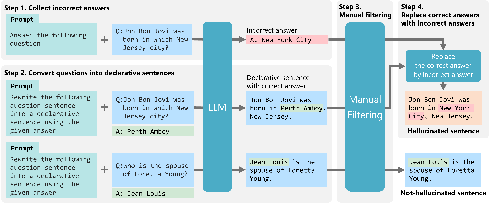

# QA2HALL: A Framework for Generating Non-trivial Hallucination Detection Datasets from KGQA Datasets

The flamework introduced in "QA2HALL: A Framework for Generating Non-trivial Hallucination Detection Datasets from KGQA Datasets."  
The dataset created using this framework for the experiments in our paper is available on Zenodo:  
https://doi.org/10.5281/zenodo.15278336


## Overview
QA2HALL framework constructs a hallucination detection dataset based on a KGQA (Knolwedge Graph Question Answering) dataset in the following 4 steps.
- **Step 1. Collect Incorrect Answers:** Provide questions of the KGQA dataset to the LLM to obtain incorrect answers.
- **Step 2. Convert Questions to Declarative Sentences :** Provide the KGQA questions and their correct answers to the LLM to convert them into declarative sentence.
- **Step 3. Manual filtering:** Manually review the generated incorrect answers and declarative sentences, and exclude any that are not appropriate.
- **Step 4. Replace Correct Answers with Incorrect Answers:** Replace the parts of the generated declarative sentences that correspond to the correct answers of the original questions with the generated incorrect answers.



## Requirements

* Python 3.12+
* torch 2.4.1
    - install appropriate version depends on your cuda version
    - verified with CUDA 12.2
* transformers 4.44.2
* accelerate 0.34.2
* sentencepiece 0.2.0
* protobuf 5.29.1
* tqdm 4.66.5

## How to use

### Setup
Download KQA Pro dataset from the following link and move the files into ./data/kqa_pro  
https://huggingface.co/datasets/data/kqa_pro

### Step 1 and 2.
Run the following command to get incorrect answers and declarative sentences.
```sh
python run.py -q ./data/samples/kqa_pro_samples.json -o ./data/samples -m gemma2_9B_inst --kg_path ./data/kqa_pro/kb.json  --num_example 2
```
 The files `incorrect_answers.tsv` and `declarative_sentences.tsv` will be generated in `./data/samples`.

### Step 3.
Manually annotate ``quality`` label for each row of the two tsv files obtained in the previous step.  
By default, samples with quality than 0 will be used in the next step.  
After that, place them into `./data/samples/annotated`.

### Step 4.
Run the following command to output hallucination detection dataset from the incorrect answers and the declarative sentences.

```sh
python run.py --ans_path ./data/samples/annotated/incorrect_answers.tsv --dec_sent_path ./data/samples/annotated/declarative_sentences.tsv -o ./data/samples --replace_step
```
Then, `dataset.json` will be generated in `./data/samples`

## Citation
TBD

## License
QA2HALL is released under CC BY-NC-SA 4.0 (https://creativecommons.org/licenses/by-nc-sa/4.0/)